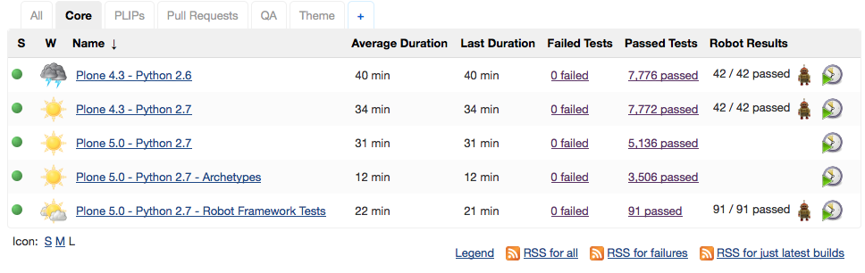
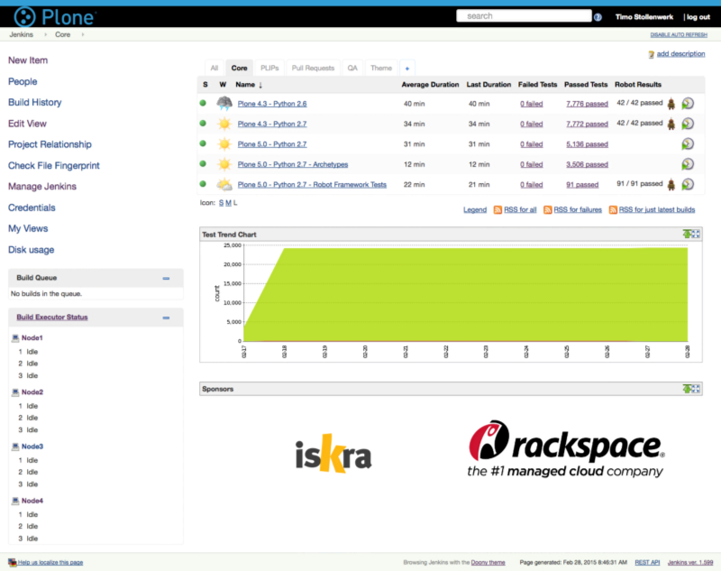

How we set up a new distributed Continuous Integration infrastructure for Plone with Jenkins, Ansible, Jenkins Job Builder, and mr.roboto.

The Plone Testing & Continuous Integration team worked hard over the last few months setting up an a new Continuous Integration (CI) infrastructure for Plone. Yesterday we were able to finally go live with our new system on jenkins.plone.org.

jenkins.plone.org after the migration to the new server. All builds are green.

# A New Jenkins Server

Gil Forcada, Ramon Navarro Bosch and I moved our Jenkins master server to a new and more powerful machine. We are using a distributed CI system with a Jenkins server, to collect and serve the test results, and a few nodes that actually run the tests. This allows us to easily scale our CI infrastructure and makes sure the Jenkins web interface is always responsive, even though the nodes are under heavy load.

For the server setup we are using Ansible, a Python-based Open Source provisioning system. We are now able to automatically generate our entire CI infrastructure, including the Jenkins master, all nodes and our custom middleware component (mr.roboto) with those two Ansible playbooks:

https://github.com/plone/jenkins.plone.org/blob/master/jenkins_server.yml

https://github.com/plone/jenkins.plone.org/blob/master/jenkins_node.yml

In order to allow other people to re-use our work, we factored out the generic parts of the configuration into two Ansible playbooks:

https://github.com/plone/plone.jenkins_server

https://github.com/plone/plone.jenkins_node

Sven Strack and I moved our Jenkins node configuration to Ansible during Plone Open Garden 2014, after Rackspace kindly provided us with new servers. Gil pushed things further and wrote the Ansible server configuration.

# mr.roboto

mr.roboto is a Pyramid-based middleware component that Ramon wrote during the 2012 Testing/CI-sprint in Barcelona. Plone core has more than 300 Python packages in separate github repositories, which makes it challenging (to say the least) to decide which package needs to be build and which CI jobs needs to be triggered for a specific commit. In addition, the way the Jenkins git/github plugins are written, makes it very hard to pass git commit messages between Jenkins jobs that use a different base repository.

mr.roboto handles this kind of Plone core-specific complexity for us. It detects commits to any Plone core repository by scanning the sources.cfg file in buildout.coredev (our main Plone development repository) and automatically creates post-commit hooks for those repositories. When mr.roboto detects a commit, it automatically adds those commits to the corresponding buildout.coredev branch.

This way we get buildout.coredev branches that contain all commits for a specific Plone version, as if Plone would have only one single repository.

Say for example you do a direct commit to the plone.formwidget.namedfile master branch. mr.roboto will automatically create two buildout coredev commits, because the master branch is used by both Plone 4.3. and 5.0. If the package would only be used by one Plone version, mr.roboto would only commit to that specific buildout.coredev branch. Those mr.roboto commits look like this:

> [fc] Repository: plone.formwidget.namedfile

The “[fc]” stands for “fake commit” since it was not a direct commit to buildout.coredev. Here is an example of a real commit that is added by mr.roboto:

https://github.com/plone/buildout.coredev/commit/17ce1ff961baf5687f342234236487ea15a275d2

Having a single repository that contains all our commits, the Jenkins github plugin can take over. It automatically starts a Jenkins job for every buildout.coredev commit. In addition the plugin is smart enough to detect which branch needs to be build. For instance, a mr.roboto commit to the 4.3 branch will only trigger 4.3 jobs and not the 5.0 jobs.

With this approach, we make sure we run the right jobs for each commit while keeping the mr.roboto logic separated from Jenkins.

# Jenkins Job Builder
Jenkins Job Builder is a Jenkins plugin, which is developed and maintained by the Open Stack community. It allows us to automatically create all our Jenkins jobs within minutes. It uses a simple YML syntax and, since it is written in beautiful Python, it is easy to extend. Gil did a fantastic job over the last months, moving all our job configurations from a custom buildout recipe I wrote some time ago (collective.recipe.jenkinsjobs) to Jenkins Job Builder. Here is our configuration file:

https://github.com/plone/jenkins.plone.org/blob/master/jobs.yml

# Coredev Jenkins Jobs

We have more than 8000 tests in Plone core, including some long running acceptance tests. Running all those tests takes more than one and a half hour.

An effective CI system needs to give developers a response as fast as possible. Therefore we split up the Plone 5.0 Jenkins job into three separate jobs; one for the core tests; one for all Archetypes-related tests; and one for Robot Framework-based acceptance tests. This allows us to reduce the test execution time to 30 minutes.

30 minutes is already quite good, taking into consideration how many tests we have to run. Though, there is more to come. Cloudbees, the company behind Jenkins, just released a Jenkins workflow plugin which looks very promising. It might become a game changer for Open Source CI systems. This plugin will allow us to present the test results (which are currently spread across three jobs) in a single job, while still being able to run our tests in parallel.

Since the workflow plugin is relatively new, other Jenkins plugins need to catch up before we can use it in production (e.g. there is currently no support for the xvfb plugin, which we need to dynamically set up an X-server for our Selenium tests). Here is a sneak preview of the new unified Plone 5 job:

https://github.com/plone/jenkins.plone.org/blob/master/flow.groovy

We think the Jenkins workflow plugin will allow us to create a complex CI and deployment pipeline in the future. This will hopefully enable us to give developers a first response within less than 10 minutes and will also significantly improve and speed up the entire Plone release process.

# Github Authentication

Gil set up the Jenkins Github plugin to authenticate against github instead of LDAP. This will allow every Plone core developer to log into jenkins.plone.org without having to provide a password and start jobs manually if necessary.

# Jenkins Theme
We branded and customized our Jenkins theme with the Dooney Jenkins theme and the Simple Theme plugin. This is how it looks now:

The new jenkins.plone.org theme.

# Documentation and Testing
We fully documented our work in a Sphinx-based documentation that we uploaded to readthedocs.org:

http://jenkinsploneorg.readthedocs.org/en/latest/

This way, everybody with the proper credentials (currently, Gil, Ramon, Sven and I) can set up or fix our CI infrastructure at any point.

Gil also set up a Vagrant images so we can test our Ansible and Jenkins Job Builder provisioning before pushing things to the live machine.

# Future Steps

We have tons of ideas how we could further improve our setup and there are lots of things to do. See https://github.com/plone/jenkins.plone.org/issues for details.

Though, there are a few issues that Plone core developers were asking for for quite some time now.

1) Auto-generated PLIP (Plone Improvement Proposals) jobs to make it easier for core developers to test those PLIPs.

2) Testing github pull requests. This is a feature that CI systems like travis or drone.io provide out of the box but that are not easy to implement with Jenkins. We plan to allow developers to manually trigger pull request tests. In the future we might want to fully automate this procedure.

With the new infrastructure we hope to be able to provide those further enhancements soon. Stay tuned.