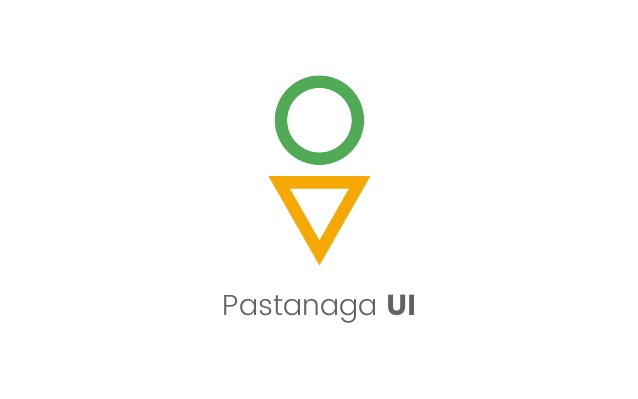
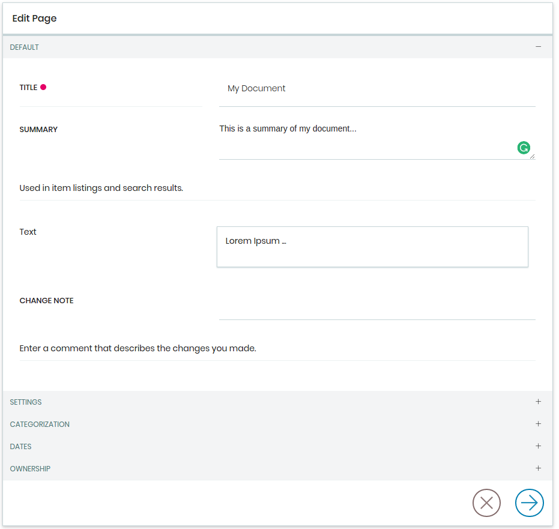
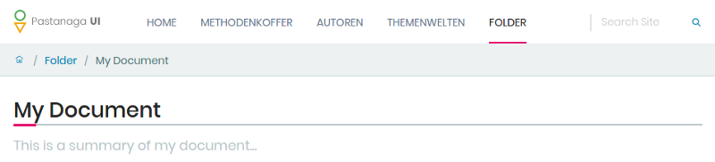
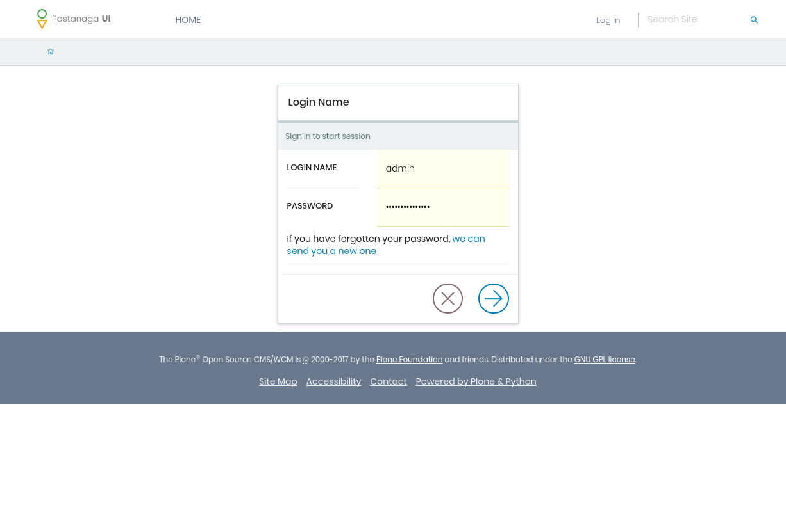
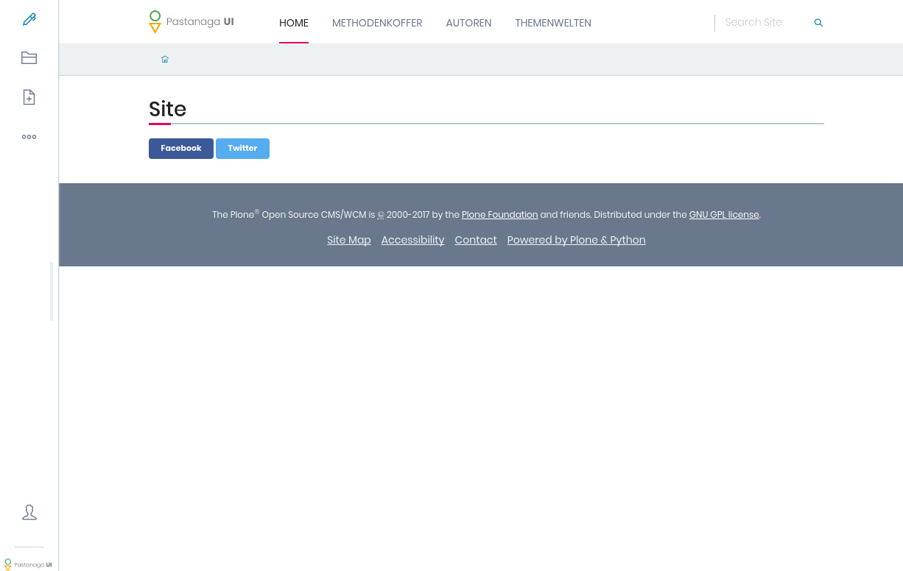

Pastanaga is a new user experience framework for the web, designed by Albert Casado.

Pastanaga was first presented in March 2017, at the Plone Open Garden in Sorrento. In July, we started with an initial implementation during the Midsummer Sprint in Jyväskylä, Finnland.

Pastanaga was also present at the recently held Plone Conference in Barcelona, where Albert gave a presentation on it. In addition, Eric Steele, the Plone release manager, gave us the opportunity to present Pastanaga to the audience during his keynote on the first day of the conference.

With all the positive feedback and energy we took from the Plone Conference, we wanted to push things further and we just couldn’t wait until our "Beethoven Sprint", which is planned for early 2018. Therefore we decided to organize a small and focused sprint at our office in Bonn to work on the implementation of Pastanaga.

# The Pastanaga Minimal Viable Product

As an Open Source community (and software engineers) with many years of experience in designing and building complex Content Management System applications, we sometimes have the tendency trying to solve all the problems at once.

Over the years we encountered and solved many complex problems and when we build something new, this can be both a source of wisdom as well as a baggage that you carry around.

This sometimes led to a situation where we were over-engineering solutions, to solve all the problems that we encountered over the years at once. Enhancements sometimes stayed around for years without really becoming production ready and usable in real-world projects.

To avoid this from happening when working on implementing Pastanaga, we decided in Jyväskylä to focus on a Minimal Viable Product.

A Minimum Viable Product (MVP) is a product with just enough features to satisfy early customers, and to provide feedback for future product development.
The Pastanaga MVP needs to provide what we consider the essentials of a Content Management System:

- A site administrator can and add, edit, and delete a page

- A user can view the created pages and navigate the site structure

In order to be usable for public facing website projects, we added two additional technical requirements:

- The page should be fully rendered within 500 milliseconds

- Google should be able to crawl the contents of the website

Those requirements might sound very simple, but they are actually not.

Pastanaga aims to leverage the editing experience and reduce the complexity that we took for granted over the years. We aim to simplify the user experience for the editors by getting rid of things that we got used to. For instance, adding an image to a page should be as simple as just dragging and dropping an image to the page and Plone will take care about the heavy lifting of automatically uploading and resizing the image.

You can find a list of all the user stories that we plan to implement as part of the MVP here:

> https://github.com/plone/pastanaga#minimal-viable-product

Having the goals and scope for this set the only thing that was needed was a bunch of Plone devs and three days and nights of coding.

# Sprint Day One

After the sprinters arrived, we started with our sprint planning session. We decided to focus on the implementation of the Pastanaga MVP and work on the other issues (e.g. plone.restapi) only if we need them for the MVP.

<blockquote class="twitter-tweet" data-lang="en">
.<a href="https://twitter.com/robgietema?ref_src=twsrc%5Etfw">@robgietema</a> giving us an introduction to plone-react. <a href="https://twitter.com/hashtag/plone?src=hash&amp;ref_src=twsrc%5Etfw">#plone</a> <a href="https://twitter.com/hashtag/sprint?src=hash&amp;ref_src=twsrc%5Etfw">#sprint</a> <a href="https://t.co/Ga6Bsd3l2J">pic.twitter.com/Ga6Bsd3l2J</a>
&mdash; kitconcept (@kitconcept_gmbh) <a href="https://twitter.com/kitconcept_gmbh/status/930769599695654912?ref_src=twsrc%5Etfw">November 15, 2017</a></blockquote>

After the planning meeting, Rob gave us an introduction to plone-react, a ReactJS-based implementation of the Plone UI that he and Roel worked on over the past months and that we decided to use as a basis for our MVP.

<blockquote class="twitter-tweet" data-lang="en">
Pastanaga sprint planning meeting at our office in Bonn. <a href="https://twitter.com/hashtag/plone?src=hash&amp;ref_src=twsrc%5Etfw">#plone</a> <a href="https://twitter.com/hashtag/Sprint?src=hash&amp;ref_src=twsrc%5Etfw">#Sprint</a> <a href="https://t.co/FDpjv5wx5t">pic.twitter.com/FDpjv5wx5t</a>
&mdash; kitconcept (@kitconcept_gmbh) <a href="https://twitter.com/kitconcept_gmbh/status/930764541734113280?ref_src=twsrc%5Etfw">November 15, 2017</a></blockquote>

We went through all components, reducers, bells and whistles of the application and discussed best practices, developer environments and developer approachability.

After that session, Rob and Victor started with the implementation of Pastanaga. Davi created a pull request that adds an uninstall profile for plone.restapi and started to learn about React. Roel started to look into a way to turn the Plone site root into a Dexterity object, something that we would need to simplify the Plone editing experience. I worked on the basic Robot Framework acceptance test setup and updated the contents of the Pastanaga github repository, which is supposed to be just an entry point for all our initiatives around Pastanaga:

https://github.com/plone/pastanaga

# Day Two

On the second day, Victor finished the login form and made the error messages work.

Rob implemented the document edit accordion menu, fixed the button styling, made plone-react use the Pastanaga icons and started to work on the toolbar.

Davi added a search widget to the header, implemented the breadcrumbs navigation and added styles for the document heading and description.

Right before the wrap-up meeting of day two, Roel showed us a Plone site with a “containerish” Dexterity-based site root. We did not really expect that much progress and went to bed (some of us a lot later) still very impressed by his accomplishment.

# Day Three

On day three, Rob started to work on the new Pastanaga document edit view. He made the new edit view to show multiple content items (e.g text, image, video) and allowed to change the order of those content items via drag and drop.

Davi continued to work on the header and breadcrumbs styling. Victor looked into the mobile views of our responsive design, fixed some issues with the status messages and briefly started to look into GatsbyJS (which we plan to use to implement pastanaga.io).

# Summary

After three days (and nights) of hacking, we had:

A fully functional login form with error messages and password forgotten functionality:

A fully functional Pastanaga Toolbar that can be collapsed or expanded. With all the menu items present and the personal toolbar functionality available:

A view to add and edit pages with all the existing functionality:

In three sprint days, we accomplished our main goals and were able to create the first iteration of a Minimal Viable Product that we can use to build things upon. We plan to continue to work on this, use it in our current and upcoming projects, and of course: contribute back as much as we can.

Stay tuned for more updates on this soon!