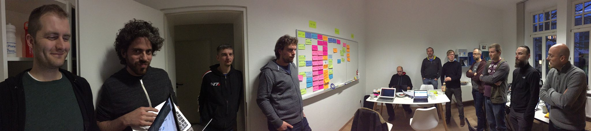

Report of the first day of the Plone Beethoven Sprint in Bonn, Germany

We started the day with a stand-up meeting giving people a heads up on the current status of plone.restapi (Timo), Plone server (Ramon and Nathan), and Plone client (Eric Brehault).

plone.restapi is in a good shape and it saw a lot of development lately. We are still in alpha. Though, we hope to finalize the last issues on the API design (framing, security, new features, etc.) during the sprint.

Plone server was also pretty actively developed lately and we are about to reveal a new name for the package (see below).

Plone client was a good proof-of-concept project for the Barcelona sprint. Though, starting from the bottom up and building lower level libraries for Angular 2 seems to be a better approach that promises faster results.

After the wrap up of the current status Ramon and Nathan revealed the new name for Plone server, which is "Guillotina".

# Swagger / Open API

Roel [investigated Swagger/Open API](https://github.com/plone/plone.restapi/issues/189) to see if we can use it to specify a common API for plone.restapi and Guillotina. It turned out Swagger has no support for arbitrary routes that we would need to specify the content travel API. He also worked on the [addable type constraint for plone.restapi](https://github.com/plone/plone.restapi/issues/173).

# plone.restapi Test Coverage

Florian and Andi [fixed an issue with threading coverage on plone.testing](https://github.com/plone/plone.restapi/issues/33).

# Guillotina

Ramon and Nathan pushed [Guillotina](https://github.com/plone/guillotina) to the Plone repository, a Travis CI setup is in place and the documentation is automatically built and pushed to [readthedocs](http://guillotina.readthedocs.io/en/latest/.

They also cleaned up the code of Guillotina and removed zope.location and zope.security from Guillotina.

They started to work on the Guillotina DB. Though, this will be a longer process with no quick results.

# plone.restapi Enhancements

Victor created pull requests for a [fix on the @search endpoint](https://github.com/plone/plone.restapi/issues/186). Fixes for several serializers. He also started to look into multi-segment URLs.

Thomas participated in the [discussion on framing/expansion](https://github.com/plone/plone.restapi/issues/149) and started to implement the [copy/paste endpoints](https://github.com/plone/plone.restapi/issues/180).

Asko worked on an extension for Sphinx that allows us to write pseudo-code request that is automatically turned into multiple formats such as Python requests, curl, wget, etc.

Mikel worked on a translations endpoint for plone.restapi. It is currently unclear, which combinations of Plone versions and LinguaPlone and plone.app.multilingual we are going to support.

Lukas worked on fixing a bug in plone.restapi on batching and the @search endpoint. He implemented more tagged values for omitting fields and started to work on the tagged values for field ordering.

# React

Rob started with an example how to use ReactJS with Plone. He created a basic login form and logout functionality. As well as basic content views.

# Angular SDK/Library

Ramon, Victor, Eric, and Timo had a discussion about an Angular wrapper around plone.restapi and Guillotina. We made decisions on licensing, scope, package naming, and the repository.

# plone.restapi 1.0a9

Timo released plone.restapi 1.0a9 today. He also added documentation for best practices and conventions we follow for plone.restapi.

# Framing

We had a longer discussion about framing in plone.restapi and Guillotina and we identified the major issues we need to figure out before we can finish the current proof-of-concept implementation. There is one API design issue left, that we hope to solve tomorrow.

# Summary

We are really happy with the progress we made on the first sprint day. The sprinters were incredibly productive. And as always, it was a lot of fun hacking on Plone.

