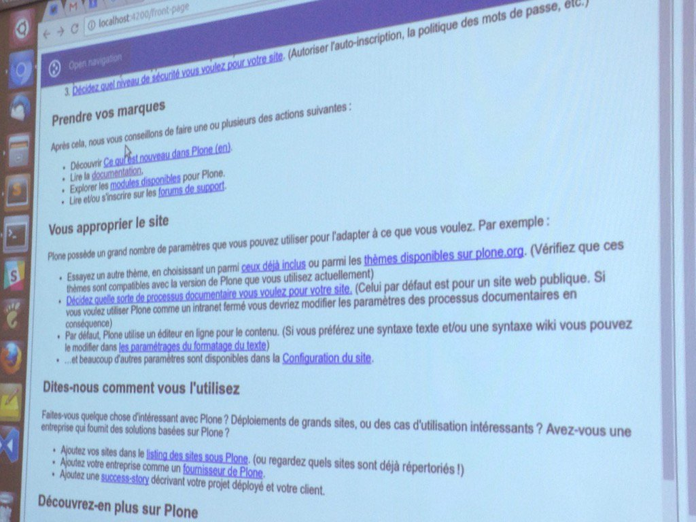

Report of the third day of the Plone Beethoven Sprint in Bonn, Germany

# Angular 2

Eric Brehault included angular-traversal in the plone.restapi-angular2 library. He added views for interfaces and support for default views. He also implemented support for basic plone.restapi components, such as navigation and breadcrumbs. At the end of the day, Eric presented an Angular 2 example application that runs on the plone.restapi-angular2 library.

# React

Rob worked on his React-based Plone demo and presented it during the wrap-up meeting.

He completed the page rendering with a Barceloneta-like user interface. A working login form and basic form rendering are in place. Content editing works, including a basic WYSIWYG editor. Navigation and a basic toolbar are working. It is now possible to change the workflow of a content object. The basic CRUD operations are also supported.

# Documentation

Lukas integrated the Sphinx extension Asko created to transform pseudo-code HTTP request into multiple different output formats.

This drastically reduces the amount of example code we have to write in the plone.restapi docs and also makes sure our examples work properly. We currently create Python requests, curl, and httpie examples using sphinxcontrib-httpexample.

# plone.api / Apitaizer

We had a discussion about integrating plone.api into plone.restapi. Andi created a refactoring tool helper called apitaizer to automatically replace functions and import locations and replace them with their plone.api counterpart.

# Testing

After Florian and Andi fixed the coverage problem in the last days, we released a new plone.testing version.

# Swagger

Victor continued to work on the Swagger docs for plone.restapi, which was mostly discussion.

# Guillotina

Ramon and Nathan continued to work on Guillotina and GuillotinaDB. Ramon gave a presentation of their work in the wrap-up session. He showed us how to create a Plone site and showed a demo of the Postgres implementation model. They are now able to partition data by content type. He showed performance improvements based on jMeter tests. They removed a lot of layers, providing the same API as ZODB, using GuillotinaDB but of course in an async way. They decided to drop ZODB support in Guillotina which is still available in the "pre-Guillotina" plone.server version.

# TUS Upload

Thomas started to work on TUS upload and was able to come up with a basic PoC implementation. This is still work-in-progress but it looks promising and we think we are not too far away from a final solution.

# Translations

Mikel continued his work on the @translations endpoint. He worked on the Plone 5 integration and the LinguaPlone endpoints for Plone. He also looked into a redirect issue with plone.restapi.

# JSON Schema

Roel worked on making schemas more approachable to API consumers and developers. He worked on the choices and reference field.

# Summary

The third day of the sprint was as productive and successful as the previous days. We presented our work at a wrap-up meeting in the late afternoon and then headed to a restaurant to eat, drink and discuss the future of Plone as a headless CMS.