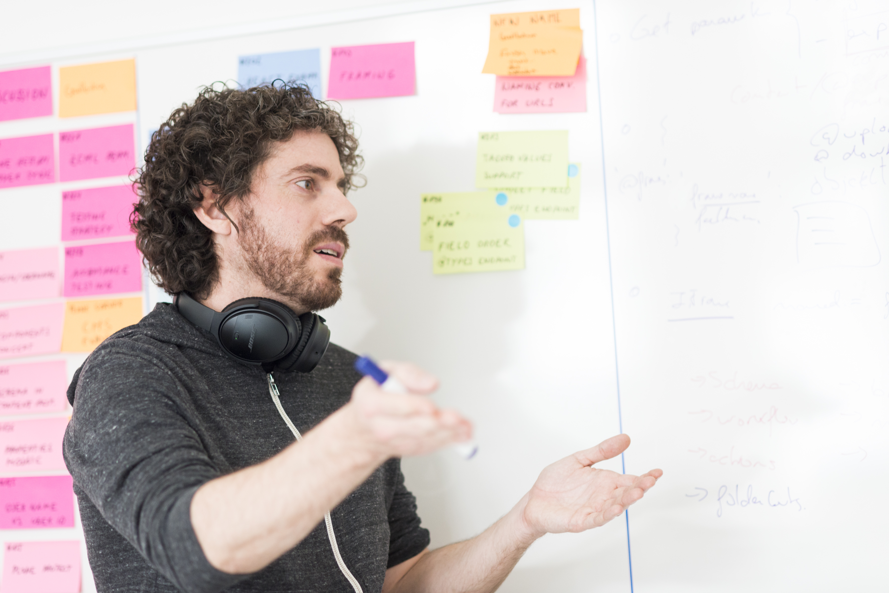
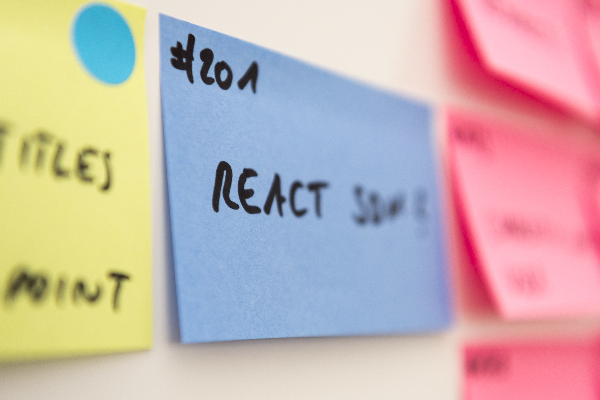

Report of the second day of the Plone Beethoven Sprint in Bonn, Germany

# plone.restapi Enhancements

Lukas refactored the @types endpoint to support all tagged value modes. He also improved the JSON schema generation in this endpoint.

Roel worked on the addable types constraints on the @types endpoint and on an issue with choices/related items.

# plone.restapi Test coverage

Florian and Andi fixed a threading issue in plone.testing that prevented the test runner from reporting the test coverage properly.

# mr.developer

Florian enhanced mr.developer to report which branches are actually checked out. This is especially helpful if you are testing a Plone core pull request on Jenkins and want to double check if the correct pull request branch has been checked out. Florian pushed a new release of mr.developer that includes the fix.

# Documentation / API Specification

Armin started to look into the plone.restapi documentation and postman examples how to use plone.restapi.

Victor participated in multiple discussions and started to write a Swagger/Open API specification.

Timo worked on documenting our API conventions and best practices.

Asko continued his work on the Sphinx extension to generate example for different request libraries and tools. He has a first version of the extension running and starts to work on going through the current plone.restapi docs to cross-check his extension.

# Guillotina

Ramon worked on Guillotina database and he and Nathan refactored and removed lots of lines from the Guillotina code base.

# Translations

Mikel worked on a translation endpoint for plone.restapi that supports both plone.app.multilingual and LinguaPlone.

# React

Rob continued to work on the React front end example for plone.restapi, he created basic add and edit forms and implemented a WYSIWYG editor. for the rich text fields.

# Angular

Eric worked on the Angular2 SDK, he created services for the basic resource API and created an example application. This example application does not only show how to use the SDK but also serves as basis for our acceptance test suiteplone

# plone.api usage in plone.restapi

Roel, Andi, Victor, Ramon, Nathan, and Timo discussed if we want to introduce plone.api as a dependency to plone.restapi. We decided that our long term goal would be that a developer with Python knowledge should be able to develop plone.restapi with just plone.api. Without the need to master the underlying structure. We are not 100% sure yet if this is doable. Though, as our favorite Catalan Plone visionary puts it:

> nobody told us that this wasn't doable

# Google Summer of Code 2017

Eric, Rob, Victor and Timo discussed possible plone.restapi and JavaScript related GSoC projects for 2017.

We already published a proposal for a progressive web app written in Angular 2. Other ideas we came up are:

- A progressive web app written in React

- A browsable API for plone.restapi

- PloneFormGen written in Angular 2

# Framing/Expansion

We had a long discussion about how to implement framing/expansion in plone.restapi. We finally reached an agreement and a draft that is pretty close to what Thomas already implemented in his pull request.

Timo will now write the documentation for the endpoint and after a final review we will adapt the existing pull request.

# Summary

Sprinters were incredibility productive today and we made considerable progress on some of the blockers of a first final release of plone.restapi.